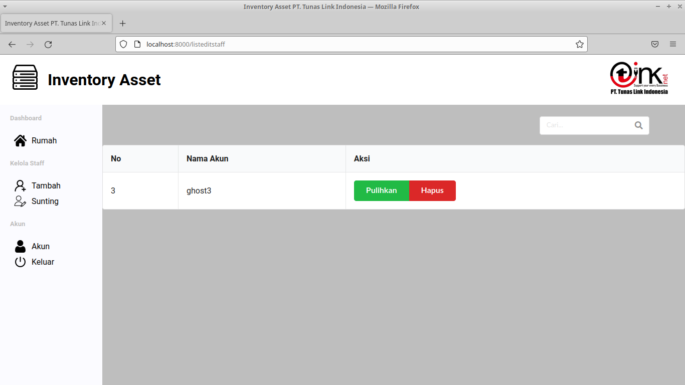

<h1>Inventory Asset PT. Tunas Link Indonesia</h1>

    <i>
        <label>IT Team</label>
        <ul>
            <li>Project Leader = Syabana Minggus Noviantosa</li>
            <li>UI/UX Designer = Perdana Raga Winata</li>
            <li>Front-End Developer = Perdana Raga Winata</li>
            <li>Back-End Developer = Syabana Minggus Noviantosa</li>
        </ul>
    </i>

 

    <b>Inventory Asset PT. Tunas Link Indonesia (Tinknet)</b> merupakan sebuah aplikasi <i>hybrid</i> pengadahan barang jaringan
    internet milik Tinknet. Aplikasi ini disebut <i>hybrid</i> karena dua <i>Framework</i> (React JS dan Laravel) digunakan dalam
    pembangunan aplikasi ini. Adapun tugas masing - masing dua <i>Framework</i> sebagai berikut :
    <ul>
        <li>
            React JS => Mengatur <i>User Interface</i>, terutama pada bagian otentikasi agar pengguna dapat mengakses situs
            berdasarkan pekerjaan <i>(role)</i>
        </li>
        <li>
            Laravel => Mengatur jalur data dari <i>database</i> ke <i>User Interface</i> baik validasi akun pengguna, penyuntingan akun
            oleh admin, maupun pengolahan data barang <i>(REST API)</i>
        </li>
    </ul>

 

    <i>
        <label>Aplikasi Pendukung</label>
        <ul>
            <li>NodeJS</li>
            <li>Composer</li>
            <li>Apache Server</li>
            <li>MySQL</li>
        </ul>
    </i>
    <code>
        CATATAN :  
        Untuk <i>Apache Server</i> dan <i>MySQL</i>, diperbolehkan memasang <i>XAMPP</i> di mesin komputer anda sebagai pengganti
        kedua aplikasi pendukung tersebut.
    </code>

    <i>
        <label>Tampilan</label>
        <ul>
            <li>Login Page</li>
            
        </ul>
        <ul>
            <li>Home Page (Admin Barang)</li>
            
        </ul>
        <ul>
            <li>Home Page (Admin Register)</li>
            
        </ul>
        <ul>
            <li>Home Page (Staff)</li>
            
        </ul>
        <ul>
            <li>Form Barang</li>
            
        </ul>
        <ul>
            <li>Sunting Barang</li>
            
        </ul>
        <ul>
            <li>Form Staff</li>
            
        </ul>
        <ul>
            <li>Sunting Staff</li>
            
        </ul>
        <ul>
            <li>Form Akun</li>
            
        </ul>
    </i>

    <i>
        <label>Daftar link REST API</label>
        <ul>
            <li>/api</li>
            
METHOD => GET

            
FUNGSI => Mengecek server

        </ul>
        <ul>
            <li>/api/usertinknet</li>
            
METHOD => POST

            
FUNGSI => Validasi akun

        </ul>
        <ul>
            <li>/api/usertinknet/show</li>
            
METHOD => GET

            
FUNGSI => Menampilkan semua akun staff

        </ul>
        <ul>
            <li>/api/usertinknet/show/{parameter}</li>
            
METHOD => GET

            
FUNGSI => Menampilkan informasi akun

        </ul>
        <ul>
            <li>/api/usertinknet/update/{parameter}</li>
            
METHOD => POST

            
FUNGSI => Mengubah informasi akun

        </ul>
        <ul>
            <li>/api/usertinknet/store</li>
            
METHOD => POST

            
FUNGSI => Menambahkan akun staff

        </ul>
        <ul>
            <li>/api/usertinknet/delete/{parameter}</li>
            
METHOD => GET

            
FUNGSI => Menghapus akun staff

        </ul>
        <ul>
            <li>/api/usertinknet/reset/{parameter}</li>
            
METHOD => GET

            
FUNGSI => Mengubah ulang informasi akun ke setelan default

        </ul>
        <ul>
            <li>/api/databarang</li>
            
METHOD => GET

            
FUNGSI => Menampilkan daftar barang

        </ul>
        <ul>
            <li>/api/databarang/store</li>
            
METHOD => POST

            
FUNGSI => Menambahkan informasi barang

        </ul>
        <ul>
            <li>/api/databarang/show/{parameter}</li>
            
METHOD => GET

            
FUNGSI => Menampikan informasi barang

        </ul>
        <ul>
            <li>/api/databarang/update/{parameter}</li>
            
METHOD => POST

            
FUNGSI => Mengubah informasi barang

        </ul>
        <ul>
            <li>/api/databarang/total</li>
            
METHOD => GET

            
FUNGSI => Menampilkan total barang dengan kondisi bagus

        </ul>
        <ul>
            <li>/api/dataexport</li>
            
METHOD => GET

            
FUNGSI => Mengunduh daftar barang dalam bentuk xlsx (Format Excel)

        </ul>
    </i>

    <i>
        <label>Cara Pemasangan</label>
        <ul>
            <li>Pastikan aplikasi pendukung (tertera di atas) terpasang</li>
            <li>Unduh aplikasi ini langsung dari Github</li>
            <li>Pastikan "databaseTinknet" terpasang di MySQL</li>
            <li>Ketik perintah "php artisan migrate" di terminal atau command prompt</li>
            <li>Jalankan aplikasi dengan mengetik perintah "php artisan serve --host=0.0.0.0" di terminal atau command prompt</li>
        </ul>
    </i>

    <label>CATATAN KECIL :</label>
    Ketika akun telah dibuat, secara <i>default</i> menggunakan kata sandi <i>"tinknet123"</i>. Kata sandi tersebut dapat diubah
    oleh pengguna guna meningkatkan keamanan. Namun, <i>REST API</i> belum menggunakan <i>API Token</i> sehingga otentikasi akun
    terbilang belum aman. Sangat disarankan untuk menambahkan <i>API Token</i> sendiri.

